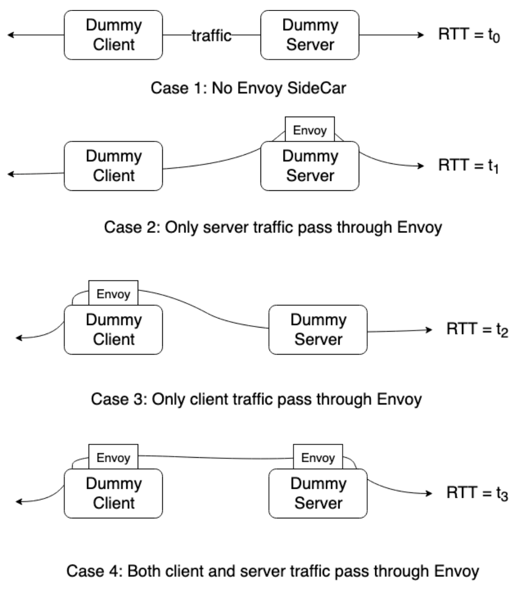
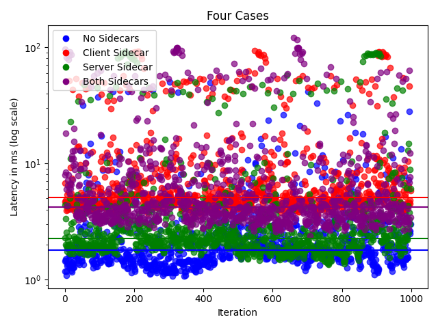

# Service Mesh Testing Toolkit

## Intro
AWS App Mesh (and ECS Service Connect) is a service mesh solution that helps customers manage the network traffic between their microservices. App Mesh and Service Connect achieve this by leveraging a dedicated sidecar, which is currently powered by the open-source project called Envoy.

Envoy is a self-contained process that runs in parallel with all application services. Therefore, App Mesh incurs latency into existing customer infrastructure. As a result, we get feedback from customers that App Mesh added latency causing timeouts into their traffic (as App Mesh has a [default 15 sec HTTP timeout](https://docs.aws.amazon.com/app-mesh/latest/APIReference/API_HttpTimeout.html)). It is not always clear whether the timeouts are being caused by the added latency from App Mesh or if it is due to long customer client-server communications. Using this tool, we can determine the added latency of App Mesh more precisely. 

## How to Use the Tool
This tool can be used to test the Round-Trip Time (RTT) in a fraction of any service mesh. The files within the colorapp folder build a configurable image for a client, while the files within the feapp folder build a configurable image for a server. These images can be used together to replace any client/server to understand the RTT from within the service mesh.

In this example, we consider the mesh described in the example [howto-http-retries](https://github.com/aws/aws-app-mesh-examples/tree/main/walkthroughs/howto-http-retries/). At a high-level, we are replacing the client and server in this example with our own images that can measure RTT with various configurations. With the four deployments that follow, we are considering the differences in latencies depending on the four Envoy sidecar configurations depicted below. 



These various sidecar setups are configured by changes in the task definitions found in the yaml files. Specifically, we are adding or removing the Envoy container found in the task definition of the client or server (which in this example are named FrontTaskDef and BlueTaskDef, respectively). Take a closer look at these task definitions within the yaml files for a deeper understanding of the changes made. 

## Prerequisites
1. Install Docker. It is needed to build the demo application images.

## Setup

1. Clone this repository and navigate to the example folder, all commands will be ran from this location

1. Your account id:
    ```
    export AWS_ACCOUNT_ID=<your_account_id>
    ```

1. Your region
    ```
    export AWS_DEFAULT_REGION=us-west-2
    ```
1. The latest envoy image, see https://docs.aws.amazon.com/app-mesh/latest/userguide/envoy.html
   ```
   export ENVOY_IMAGE=<from_appmesh_user_guide_above>
   ```
    
5. Deploy the resources (this will take about 5-10 minutes to complete):
    ```
    ./deploy-1.sh
    ```
This will create 'output.png', which is a graph displaying the data when no Envoy sidecars are used. This data is also exported to the spreadsheet 'output.xlsx'

6. Next we consider the case with an Envoy sidecar only on the client-side:
    ```
    ./deploy-2.sh
    ```
Similarly, this replaces 'output.png' with a graph displaying the data when there is only a client sidecar.

7.  We now consider when there is no client Envoy sidecar, but there is a server Envoy sidecar:
    ```
    ./deploy-3.sh
    ```

1. Finally, deploy the app for Envoy sidecars on both the client and server sides:
    ```
    ./deploy-4.sh
    ```

1. We can now assemble the data gathered from all these configurations into one graph:
    ```
    python3 graph.py  
    ```
This creates the graph 'four_cases_graph.png', which gives a visualization of the differences of the various Envoy sidecar configurations. 

## Results
Following these steps results in the four_cases_graph that will look similar to this:



For each of the four Envoy sidecar configurations, we have run 1000 requests from client to server and plotted the RTT. It is evident how the different configurations result in different median RTT values. Nevertheless, in all cases, the medain RTT is under 10 ms, implying that in this service mesh App Mesh will, on average, never add a latency greater than this. This is far less than App Mesh's default timeout of 15 seconds, implying that any timeouts in this service mesh must result from other long communications. 

## Command Line Configurations

Given a deployment, we can make various configurations to the client and server images such as configuring added latency, configuring the response from the server, and configuring the number of traffic requests from the client to the server. 

After any of the deployments from the demo, we will recieve a public endpoint. Take this public endpoint and save it:
```
export ENDPOINT=<public endpoint>
```

To get the RTT given any configuration, we run the following command 
```
curl $ENDPOINT/testing
```
This returns a json string with values for added_latency, response, processing_time, traffic, and most importantly, RTT. 

Let's dive deeper into each of these. 

### Added latency
In a production service, making a call from client to server often does not only involve these two nodes, as the server may have to make additional requests to other backend nodes. This can all increase the latency. We can mimic this added latency by having our server sleep for a given number of seconds, hence the configuration for added latency. We can change the added latency of the server by making a POST request:
```
curl -X POST -d '{"added_latency": <ADDED LATENCY IN SECONDS>}' $ENDPOINT/testing
```

Note that App Mesh has a 15-second default timeout, and we can see this timeout when the added latency is changed to 15 seconds or more. 

### Response & Processing Time
We can also configure the response sent from the server back to the client. This can be sent as a POST request to ENDPOINT. For a basic string, we can do this with the following command:

```
curl -X POST -d '{"response": <RESPONSE AS A STRING>}' $ENDPOINT/testing
```

We may wish to see how responses of different sizes could have different effects on latency, and this response configuration allows this. In particular, recall the key "processing_time" in the JSON string resulting from curling ENDPOINT. This refers to the time (in seconds) that it takes for "response" to be processed by the server. 

### Traffic

The traffic configuration refers to the number of consecutive requests made from the client to the server. This is a basic method of load testing. This parameter can be configured with the following command:

```
curl -X POST -d '{"traffic": <NUMBER OF REQUESTS>}' $ENDPOINT/testing
```

### RTT
Round-trip Time (RTT) is measured as the difference between the time when the client makes a request to the server and the time when the client receives a response. The RTT given when curling ENDPOINT is given in seconds. 

## Clean up 

Run the following command to remove all resources created from this demo (will take 5-10 minutes): 
```
./deploy.sh delete
```
